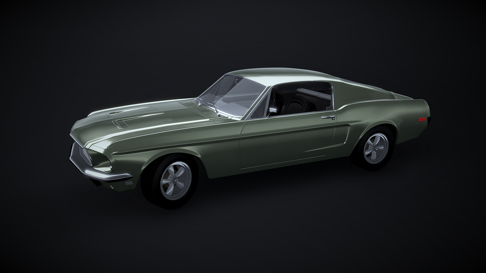

# Unity3D High resolution car rendering demo

This repository provides a demo of rendering a high poly car model.

* It uses standard assets for rendering
* All materials are standard shaders

* Car Model is from: http://www.blendswap.com/blends/view/82339
* Leather texture is from: http://webtreats.mysitemyway.com/free-tileable-leather-patterns/

